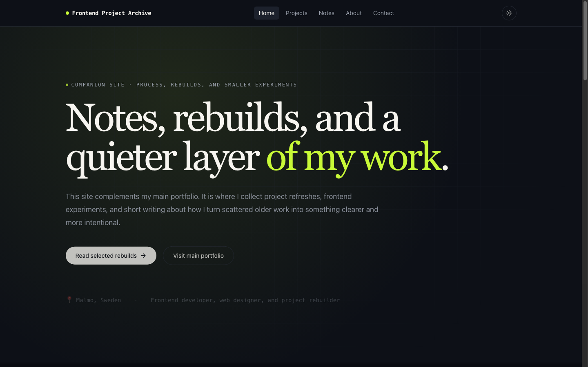
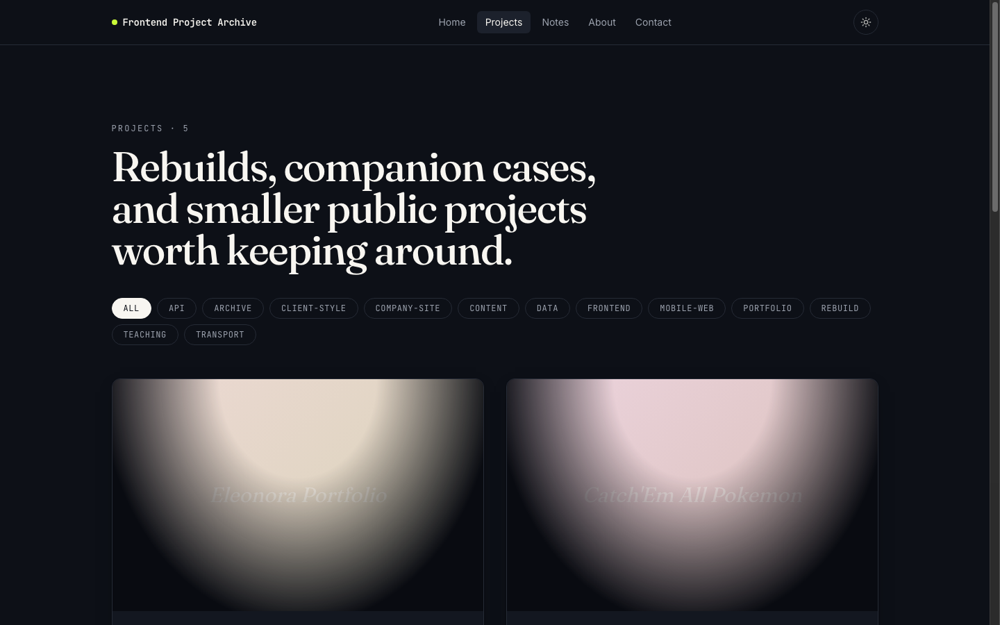
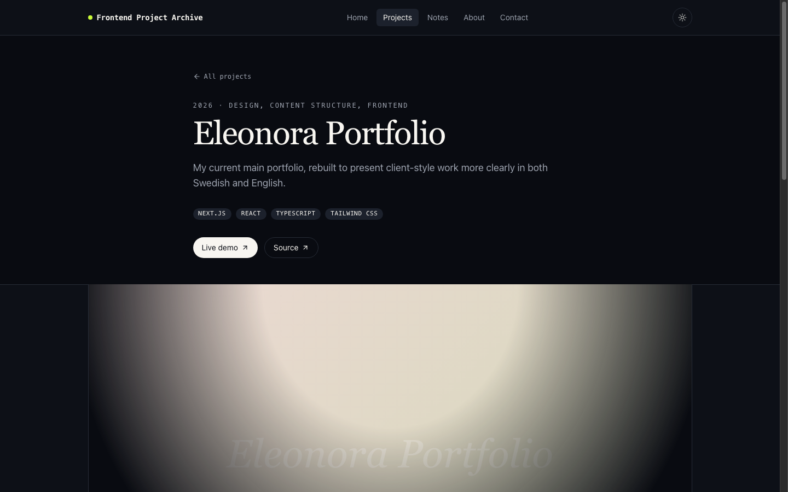
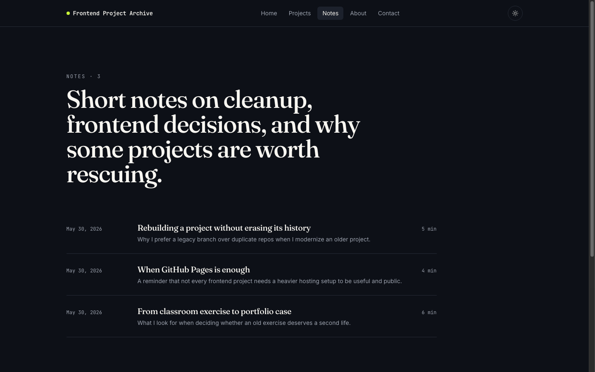
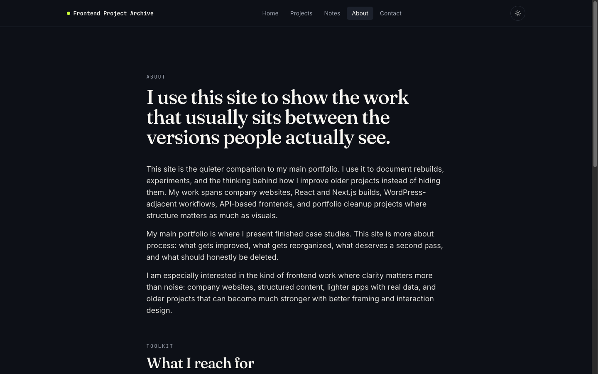

# Frontend Project Archive

A public companion site to my [main portfolio](https://eleonora-portfolio.netlify.app/). It documents frontend project rebuilds, smaller experiments, and short notes on cleanup, versioning, and presentation — the work that sits next to finished case studies.

**Live site:** [frontend-project-archive.netlify.app](https://frontend-project-archive.netlify.app/)

## Overview

| | |
|---|---|
| **Purpose** | Archive of rebuilds, demos, and process writing |
| **Audience** | Recruiters, collaborators, and future me |
| **Content model** | Typed local files — no CMS or backend |
| **Deployment** | Netlify (SPA with client-side routing) |

The main portfolio presents polished outcomes. This repository hosts the layer around that work: how older projects were refreshed, what changed, and which smaller public builds still say something about how I work.

## Screenshots

### Home

Editorial landing page framing the site as a rebuild and experiment archive.



### Projects

Curated list of selected repositories with tags, summaries, and links to live demos.



### Project detail

Individual case view with context, stack, outcomes, and external links.



### Notes

Short articles on refactoring, hosting choices, and portfolio cleanup.



### About

Background, experience timeline, and how this site relates to other repos.



## Features

- **Projects** — Selected real repos with metadata, categories, and live demo links
- **Notes** — Markdown-backed posts on process and technical decisions
- **About & contact** — Site purpose, experience, and mailto contact flow
- **Dark / light theme** — System-aware theme toggle
- **Motion** — Subtle page transitions with Framer Motion
- **Accessible layout** — Semantic structure, keyboard-friendly navigation

## Tech stack

| Layer | Choice |
|---|---|
| UI | React 18, TypeScript |
| Build | Vite 5 |
| Styling | Tailwind CSS, shadcn/ui primitives |
| Routing | React Router (BrowserRouter) |
| Content | Local typed modules in `src/content/` |
| Animation | Framer Motion |
| Hosting | Netlify |

## Project structure

```text
frontend-project-archive/
├── docs/screenshots/     # README visuals
├── public/
├── src/
│   ├── components/       # Layout, cards, UI primitives
│   ├── content/          # Profile, projects, posts (source of truth)
│   ├── pages/
│   ├── App.tsx
│   └── main.tsx
├── netlify.toml          # Build + SPA redirects
├── index.html
└── vite.config.ts
```

## Content sources

All copy and metadata live in version-controlled TypeScript files:

- [`src/content/profile.ts`](./src/content/profile.ts) — Site identity and experience
- [`src/content/projects.ts`](./src/content/projects.ts) — Project catalog
- [`src/content/posts.ts`](./src/content/posts.ts) — Notes and articles
- [`src/content/types.ts`](./src/content/types.ts) — Shared types

## Local development

```bash
git clone https://github.com/Elli2022/frontend-project-archive.git
cd frontend-project-archive
npm install
npm run dev
```

Open the URL printed by Vite (default port `8080`).

### Scripts

| Command | Description |
|---|---|
| `npm run dev` | Start development server |
| `npm run build` | Production build to `dist/` |
| `npm run preview` | Preview production build locally |
| `npm run lint` | ESLint |
| `npm test` | Vitest unit tests |

## Deployment (Netlify)

The site deploys from `main` via Netlify:

1. **Build command:** `npm run build`
2. **Publish directory:** `dist`
3. **SPA routing:** `netlify.toml` rewrites all routes to `index.html`

Manual deploy from the CLI:

```bash
npm run build
npx netlify deploy --prod --dir=dist
```

## Related repositories

| Repository | Role |
|---|---|
| [`eleonora-portfolio`](https://github.com/Elli2022/eleonora-portfolio) | Main public portfolio |
| [`code-sanctuary`](https://github.com/Elli2022/code-sanctuary) | Private source of the original design direction |

## Author

**Eleonora Nocentini Skoldebrink**

- GitHub: [@Elli2022](https://github.com/Elli2022)
- Main portfolio: [eleonora-portfolio.netlify.app](https://eleonora-portfolio.netlify.app/)
- Email: [eleonora.nocentini@gmail.com](mailto:eleonora.nocentini@gmail.com)

## License

This project is for portfolio and learning purposes. Project-specific assets and third-party content remain subject to their respective licenses.
